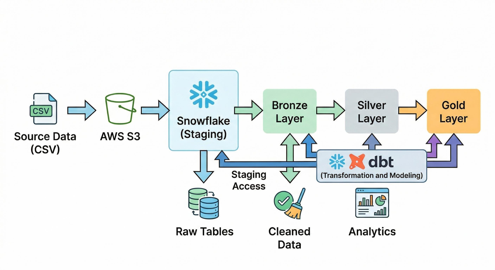

## 📌 Overview
This project demonstrates how to build a **scalable, modern data analytics pipeline** using the **Medallion Architecture (Bronze → Silver → Gold)**.

It ingests raw CSV data, processes it through layered transformations, and delivers analytics-ready datasets.

---

## 🖼️ Architecture Diagram

---

## ⚙️ Tech Stack

- **Cloud Storage:** AWS S3  
- **Data Warehouse:** Snowflake  
- **Transformation Tool:** dbt (Data Build Tool)  
- **Data Format:** CSV  
- **Modeling Approach:** Medallion Architecture  

---

## 🏗️ Architecture Explanation

### 1. Source Layer
- Raw data in CSV format
- Represents transactional e-commerce data

### 2. AWS S3 (Data Lake)
- Stores raw files
- Acts as ingestion layer for Snowflake

### 3. Snowflake (Staging)
- External/Internal stages created
- Data loaded into **raw tables**
- Serves as entry point for transformations

---

## 🥉 Bronze Layer (Raw Data)
- Data is ingested as-is from source
- Minimal transformations
- Handles:
  - Schema alignment
  - Basic ingestion logic
- Purpose: **Data reliability and traceability**

---

## 🥈 Silver Layer (Cleaned Data)
- Data cleaning and transformation applied
- Handles:
  - Null handling
  - Data type casting
  - Deduplication
  - Standardization
- Output: **Structured, query-ready datasets**

---

## 🥇 Gold Layer (Business Layer)
- Aggregated and business-ready data
- Used for:
  - Reporting
  - Dashboards
  - KPI tracking
- Example:
  - Revenue metrics
  - Customer insights
  - Sales performance
